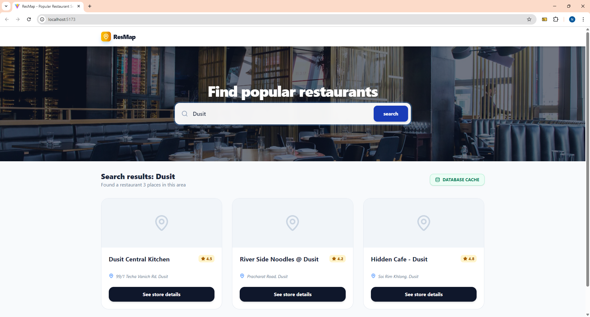

# ResMap - Popular Restaurant Search System
**ResMap** is a web application designed for location-based restaurant searching. This project demonstrates the integration between a modern Frontend and Backend, featuring **Database Caching** to reduce external API overhead and significantly improve system response time.

## Setup instructions
### 1. Prerequisites
1. Clone or download the source code.
2. Open your Terminal and navigate to the root directory: `cd resmap`
### 2. Backend Setup (Laravel)
1. Navigate to the backend folder: `cd backend`
2. Install dependencies: `composer install`
3. Create environment configuration: `cp .env.example .env`
4. **Database Preparation:** - Create a new empty database in MySQL named `resmap_db`
5. Update your `.env` file with your local database credentials:
<pre>
DB_CONNECTION=mysql
DB_HOST=127.0.0.1
DB_PORT=3306
DB_DATABASE=resmap_db
DB_USERNAME=root
DB_PASSWORD=
</pre>
6. Generate application key: `php artisan key:generate`
7. Run database migrations: `php artisan migrate`
8. Start the backend server: php artisan serve (Runs on port 8000)
### 3. Frontend Setup (React)
1. Open a new Terminal tab and navigate to the frontend folder: `cd frontend`
2. Install dependencies: `npm install`
3. Start the development server: npm run dev (Runs on port 5173)
  
## Frameworks used.
-  **Frontend:** React 19 + Tailwind CSS v4
-  **Backend:** Laravel 12 (PHP 8.2+)
-  **Database:** MySQL

## How to run and test the app.
1. **New API Data:** When searching for a new location (e.g., "Dusit"), the system fetches data from a Mock API and persists it into MySQL immediately.

2. **Database Cache:** When searching for the same location again, the system retrieves data directly from the local database instead of calling the external API.

3. **Database Inspection:** You can view all cached records via the API endpoint: http://127.0.0.1:8000/api/all-caches

## Any known issues or limitations.
-  **API Authentication:** Currently, the system utilizes a **Mock API** to demonstrate caching logic due to Google Maps Platform's credit card billing requirements for API keys.

## Developed by
**Natchapol Jongsathapornpun (Tae)**
